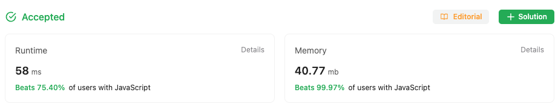

## Multiple Approaches to solve the problem

### First approach

In first approach had to use extra array data structure to store the split string chars
along with the stack to store the parenthesis

### Second approach

Used inbuilt `charAt` method of string to check for the chars in the string itself
This was even efficient when traversing the string as charAt is more optimized way of
traversing the string, as for longer string iteration and storage would increase.

### Stats from LeetCode

For the optimized approach, beat 99.9% JS users by following above approach

