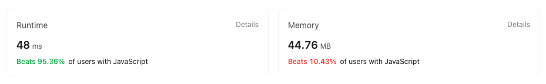

## First Approach

We go iteratively in the first approach

We first check if the head or head of next are not null, in case case they are nothing needs
to be done and we simply return the head

Here we need to store nodes into previousNode, currentNode and nextNode buckets to able to
solve the problem iteratively

As we start with the first node which is head in our case, we need to set its next as null
as in resulting reverse operation first Node will become last and point to null

So we start with previousNode set to null and we point currentNode to head

We perform operations on currentNode in the while loop

We check if currentNode is not null, in case we reached the end of the loop. We iteratively point currentNode
to the next node so that we move ahead in the linkedlist and keep reversing the list step by step

We first store the next of currentNode into nextNode so that when we replace the currentNode to previous,
we do not lose the chain to proceed further. After we set currentNode.next -> previousNode, we make
previousNode point to currentNode as we need to move ahead in the list and similarly point the
currentNode to the nextNode

This is done iteratively until we reach the end and after the loop, we point the head to previousNode which
is the last non empty node.

```
/**
 * Definition for singly-linked list.
 * function ListNode(val, next) {
 *     this.val = (val===undefined ? 0 : val)
 *     this.next = (next===undefined ? null : next)
 * }
 */
/**
 * @param {ListNode} head
 * @return {ListNode}
 */
var reverseList = function(head) {

    if(head === null || head.next === null ) return head
    let previousNode = null
    let currentNode = head

    while(currentNode !== null){
        let nextNode = currentNode.next
        currentNode.next = previousNode
        previousNode = currentNode
        currentNode = nextNode
    }

    head = previousNode

    return head
};

```

## Recursive approach

In recursive approach we assume in our case that next part of the current Node is
already reversed. So we just update the next of the reversed node to currentNode
and set currentNodes next as null, which points to the new tail of the list

Our base case is when the List is empty or list has single node
in that case we return the head pointer back.

The intuition here is that we already know the next of the current node, from
there we can always reset the next node of next of current Node

So in our case if the Link list is something like

1 --> 2 --> 3 --> null

For 1st node we know the next node is 2. And next of 2 is 3. Assuming the fact that
the remaining nodes except 1 is already reversed, we just know that we need to point
the next of 2 to 1 to make the complete list in reverse order

Let say the list is reversed, it will look something like this

3 --> 2 ---> null

1 --> 2

As we can see 1 is still pointing to 2, we just do 1 --> next --> next = 1

i.e we point the next of 2 to 1

And finally point 1 --> next = null. so make it the tail node and complete the list

We recursively send back previous list head and finally return the previous list which
now looks like this

3 --> 2 --> 1 --> null

```
/**
 * Definition for singly-linked list.
 * function ListNode(val, next) {
 *     this.val = (val===undefined ? 0 : val)
 *     this.next = (next===undefined ? null : next)
 * }
 */
/**
 * @param {ListNode} head
 * @return {ListNode}
 */
var reverseList = function(head) {

    if(head === null || head.next === null ) return head

    let prevList = reverseList(head.next)
    head.next.next = head
    head.next = null

    return prevList
};
```

## Leetcode stats

### Iterative Approach


### Recursive approach


