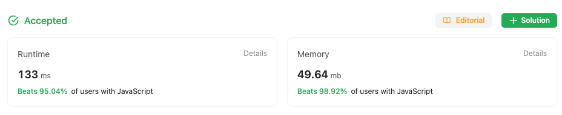

## Multiple Approaches to solve the problem

### First approach

In first approach went ahead with the inbuilt methods of JS
and the performance was not not upto the mark, although the solution was accepted

### Second approach

In second approach went with the traditional way to reverse a positive number,
later optimized the code a bit more to reduce the memory consumption
by getting rid of some variable

### Stats from LeetCode

