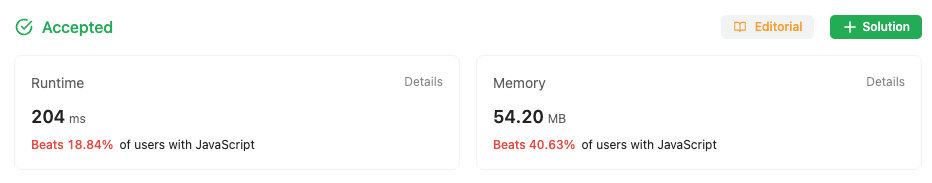

## Multiple Approaches to solve the problem

### First approach

First Approach is a Brute force Approach to solve the problem

Simply sort the array in ascending order and then check the adjacent
element if they are equal

```
/**
 * @param {number[]} nums
 * @return {number}
 */
var findDuplicate = function (nums) {
  nums.sort((a, b) => a - b).map((val, key) => (nums[key] = val));

  for (let i = 0; i < nums.length; i++) {
    if (nums[i] === nums[i + 1]) return nums[i];
  }
};


```

### Stats from LeetCode

#### Solution one stats


