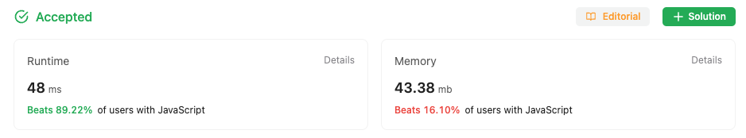

## Multiple Approaches to solve the problem

### First approach

First Approach is a Brute force Approach to solve the problem

Just walk through each row in the input array
and fill the last col in the dest array
Progress each row, decrement col and fill

```
var rotate = function (matrix) {
  const len = matrix.length;
  let otherMat = [...Array(len)].map((e) => Array(1).fill(0));
  for (let row = 0; row < len; row++) {
    for (let col = 0; col < len; col++) {
      let fixedCol = len - row - 1;
      otherMat[col][fixedCol] = matrix[row][col];
    }
  }

  for (let row = 0; row < len; row++) {
    for (let row = 0; row < matrix.length; row++) {
      for (let col = 0; col < len; col++) {
        matrix[row][col] = otherMat[row][col];
      }
    }
  }
};


```

### Optimized solution

First transpose the array, then reverse each row

```
var rotate = function (matrix) {
  const len = matrix.length;
  for (let row = 0; row < matrix.length; row++) {
    let currRow = matrix[row];
    for (let col = 0; col < row; col++) {
      let data = matrix[row][col];
      matrix[row][col] = matrix[col][row];
      matrix[col][row] = data;
    }
  }

  for (let row = 0; row < matrix.length; row++) {
    let currRow = matrix[row];
    for (let col = 0; col < currRow.length / 2; col++) {
      let data = matrix[row][col];
      matrix[row][col] = matrix[row][len - col - 1];
      matrix[row][len - col - 1] = data;
    }
  }
};

```

### Stats from LeetCode

#### Solution one stats



#### Solution 2 stats


