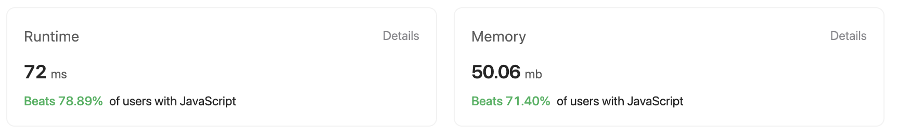

## Multiple Approaches to solve the problem

### First approach

First approach is brute force that
iterates over all the subarrays
compute the sum of them, checks which sub array
has the max sum and returns

Didn't tried that solution, as it'll go up to O(n3) complexity

### Second Approach

The approach is pretty straight forward

First checking the max element from the array,
this was done to establish as baseline that
this is the minimum sum expected from this array sequence

Worst case if the array has all negatives and we get the max
element as some negative number or 0 for that matter,
it clearly states that no matter what combination the max
is not going to exceed this number at any cost. so return
it and save the extra computations ahead

In case we've positives and probabilty there could be a
sub array that will have greater sum than or equal to the max
we go into the computation

We initialize a sum as 0 that could be the least sum possible
and Iterate over the elements from start

We check if

`current element + sum > 0`
If this is the case then we got an element
that can help in increasing the sum, we add it to
the sum.

Then we check if the current sum is greater than the
max element found earlier. This is to check if we surpassed
the max element.

If not move ahead or else replace max with new max sum value

In further iterations if we found out that the current element

- previous sum is less than 0, that means, we've reached an
  sub array which will not create max sum and we need to drop this.
  Any negative resultant sum would only decrease our overall sum
  So we drop it. We can tolerate till 0 as the next element could
  be a positive and can increase the sum.

```
var maxSubArray = function (nums) {
  // find the max element in the array
  let max = nums[0];
  for (i = 1; i < nums.length; i++) {
    if (nums[i] > max) {
      max = nums[i];
    }
  }

  // case where the array is full of negative
  // numbers or max number is zero, return max itself
  // save the iterations
  if (max <= 0) return max;

  // the idea to find the max sum was to
  // compare the current value
  let sum = 0;
  for (i = 0; i < nums.length; i++) {
    // check if current val is greater than 0
    // else skip it
    if (sum + nums[i] > 0) {
      sum += nums[i];
      if (sum > max) {
        // if the current sum of
        // sub array is greater than
        // max element, replace the max
        max = sum;
      }
    } else {
      sum = 0;
    }
  }

  return max;
};

```

### Stats from LeetCode

#### First Approach


