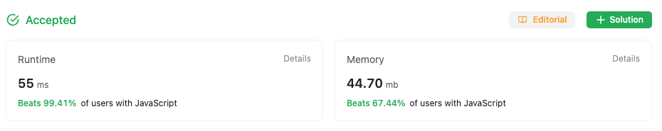

## Multiple Approaches to solve the problem

### First approach

First Approach is a Brute force Approach to solve the problem

As the requirement is to do the operation in place, we've to modify the input array as
solution. Here we're marking the corresponding row and column with a random negative number
where Zero is encountered. The reason of marking it a random negative is to pass the
test cases that are written in LeetCode. We earlier started with a -1, but as the
leetcode test suite has -1 as one of the test case our code failed for that test.

After marking the row,col with random number. Repeat the matrix iteration and now
mark all the cells with random negative number with 0 and we get our solution.

```
/**
 * @param {number[][]} matrix
 * @return {void} Do not return anything, modify matrix in-place instead.
 */
var setZeroes = function (matrix) {
  for (let i = 0; i < matrix.length; i++) {
    const row = matrix[i];
    for (let j = 0; j < row.length; j++) {
      // check if zero
      // then proceed marking the corresponding
      // row and column as -1
      if (row[j] === 0) {
        markRowCol(matrix, i, j);
      }
    }
  }

  for (let i = 0; i < matrix.length; i++) {
    const row = matrix[i];
    for (let j = 0; j < row.length; j++) {
      if (row[j] === -10000098) {
        row[j] = 0;
      }
    }
  }
  return matrix;
};

function markRowCol(matrix, i, j) {
  const row = matrix[i];
  for (let l = 0; l < row.length; l++) {
    if (row[l] !== 0) {
      row[l] = -10000098;
    }
  }

  const rowCount = matrix.length;
  for (let l = 0; l < rowCount; l++) {
    if (matrix[l][j] !== 0) {
      matrix[l][j] = -10000098;
    }
  }
}

```

### Second Approach

In second approach we're going to create 2 keepers that will store
corresponding row or col will be zero at the end of the operation

We initialize the rowKeep and colKeep with 0's with m and n length respectively
as per the original matrix rows(m) and cols(n)

We mark the rowKeep or colKeep as 1 when we encounter a zero in any cell.
Next we again iterate on the original matrix and check the rowKeep and colKeep
if they are marked to be converted we convert the cell to zero

```
/**
 * @param {number[][]} matrix
 * @return {void} Do not return anything, modify matrix in-place instead.
 */
var setZeroes = function(matrix) {

    let rowKeep = []
    for(let i=0; i < matrix.length; i++){
        rowKeep.push(0)
    }

    let colKeep = []
    for(let i=0; i < matrix[0].length; i++){
        colKeep.push(0)
    }

    for(let i=0; i < matrix.length; i++){
        for(let j=0; j< matrix[i].length; j++){
            // check if zero
            // then proceed marking the corresponding
            // rowKeep and colKeep as 1
            if(matrix[i][j] === 0){
                rowKeep[i] = 1
                colKeep[j] = 1
            }
        }
    }

    for(let i=0; i < matrix.length; i++){
        for(let j=0; j< matrix[i].length; j++){
            // check if zero
            // then proceed marking the corresponding
            // rowKeep and colKeep as 1
            if(rowKeep[i] === 1 || colKeep[j] === 1){
                matrix[i][j] = 0
            }
        }
    }
    return matrix
};
```

### Stats from LeetCode

#### Solution one stats



#### Solution 2 stats


Even though the 2nd solution is more optimized, still the LC cries of low performance 😅
