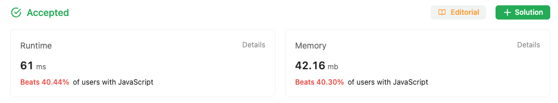

## Multiple Approaches to solve the problem

### First approach

First Approach is a Brute force Approach to solve the problem

Just sort the array in ascending order, and thats the solution

Although the solution is not optimal and takes O(n^2) complexity

```
/**
 * https://leetcode.com/problems/sort-colors/
 * @param {number[]} nums
 * @return {void} Do not return anything, modify nums in-place instead.
 */
var sortColors = function (nums) {
  for (let i = 0; i < nums.length - 1; i++) {
    for (let j = i + 1; j < nums.length; j++)
      if (nums[i] > nums[j]) {
        [nums[i], nums[j]] = [nums[j], nums[i]];
      }
  }
};

```

### Stats from LeetCode

#### Solution one stats


