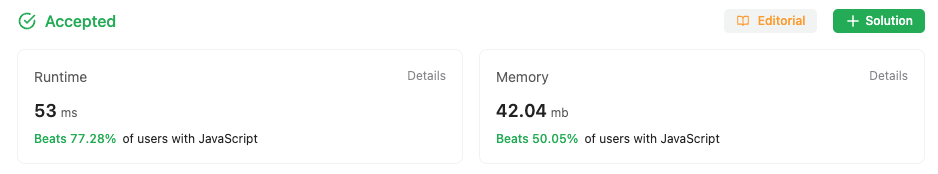

## Multiple Approaches to solve the problem

### First approach

First Approach is a Brute force Approach to solve the problem

Just sort the array in ascending order, and thats the solution

Although the solution is not optimal and takes O(n^2) complexity

```
/**
 * https://leetcode.com/problems/sort-colors/
 * @param {number[]} nums
 * @return {void} Do not return anything, modify nums in-place instead.
 */
var sortColors = function (nums) {
  for (let i = 0; i < nums.length - 1; i++) {
    for (let j = i + 1; j < nums.length; j++)
      if (nums[i] > nums[j]) {
        [nums[i], nums[j]] = [nums[j], nums[i]];
      }
  }
};

```

### Second Approach

In second approach in the first iteration
we store how many 0's and 1's are available
in the array, remaining ones are 2's

In the next iteration we just replace the first
elements in the original array with number of 0's found
then filling the 1's and the rest we simply fill with 2's

```
/**
 * @param {number[]} nums
 * @return {void} Do not return anything, modify nums in-place instead.
 */
var sortColors = function(nums) {
    let zeros=0;
    let ones=0;
    for(let i=0; i< nums.length; i++){
        switch(nums[i]){
            case 0:
                zeros++;
                break;
            case 1:
                ones++
                break;
        }
    }

    for(let i=0; i < nums.length; i++){
        if(zeros >= 1){
            nums[i] = 0
            zeros--
        } else if( ones >= 1){
             nums[i] = 1
            ones--
        } else {
             nums[i] = 2
        }
    }
};
```

### Stats from LeetCode

#### Solution one stats


#### Solution two stats


